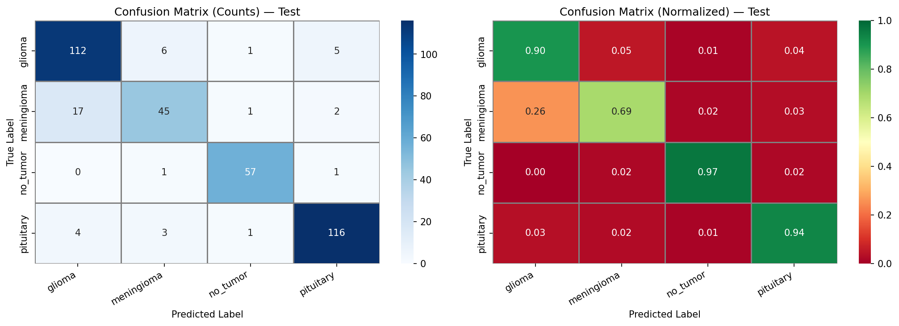
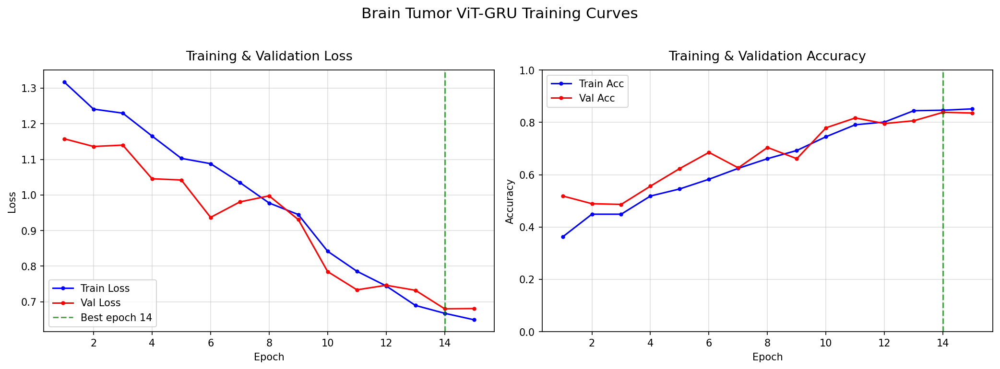

# 🧠 Brain Tumor Classification using ViT-GRU

A deep learning-based brain tumor classification system that combines Vision Transformer (ViT) and Gated Recurrent Unit (GRU) architectures to classify brain MRI images into four categories: **Glioma, Meningioma, No Tumor, and Pituitary Tumor**. The project also incorporates **Explainable AI (XAI)** techniques to provide visual explanations for model predictions.

## 📌 Project Overview

Brain tumor classification from MRI images is an important computer vision task that can assist in the analysis of medical images. This project develops a deep learning pipeline for classifying brain MRI images into four categories: **Glioma, Meningioma, No Tumor, and Pituitary Tumor**. The proposed system combines Vision Transformer (ViT) for visual feature extraction with GRU for learning sequential representations.

## 🎯 Objectives

- Classify brain MRI images into four tumor categories.
- Develop a hybrid deep learning model using ViT and GRU.
- Evaluate model performance using standard classification metrics.
- Generate confusion matrices and training curves.
- Provide explainability using Grad-CAM / Explainable AI techniques.
- Provide a user-friendly application for MRI image prediction.

## 🧠 Model Architecture

The project uses a hybrid **Vision Transformer + GRU (ViT-GRU)** architecture.

The Vision Transformer processes MRI images by dividing them into image patches and learning relationships between different regions using self-attention mechanisms. The GRU component processes the extracted feature representations and helps learn sequential dependencies in the feature representation.

### Overall Pipeline

```text
MRI Image
    ↓
Image Preprocessing
    ↓
Vision Transformer (ViT)
    ↓
Feature Extraction
    ↓
GRU
    ↓
Classification Layer
    ↓
Tumor Class Prediction
```

## 🏷️ Classification Classes

| Class | Description |
|---|---|
| Glioma | Glioma tumor |
| Meningioma | Meningioma tumor |
| No Tumor | No detectable tumor |
| Pituitary | Pituitary tumor |

## 📊 Model Performance

The model achieved an overall test accuracy of **88.71%**.

| Class | Precision | Recall | F1-Score |
|---|---:|---:|---:|
| Glioma | 84.21% | 90.32% | 87.16% |
| Meningioma | 81.82% | 69.23% | 75.65% |
| No Tumor | 95.00% | 96.61% | 95.80% |
| Pituitary | 93.55% | 93.55% | 93.55% |
| **Overall Accuracy** | — | — | **88.71%** |

The repository includes the classification report, confusion matrix, training curves, training history, and training logs in the `outputs/` directory.

## 🔍 Explainable AI

To improve model interpretability, the project includes an explainability component based on Grad-CAM techniques. This helps visualize the regions of an MRI image that contribute to the model's prediction.

Explainability is particularly important in medical imaging applications because model predictions should ideally be interpretable rather than treated as black-box decisions.

## 🖥️ Application

The project includes a **Streamlit-based application** using `brainapp.py`.

The application allows users to provide an MRI image and obtain a predicted tumor category.

The application is intended for **research and educational purposes only** and should not be used as a medical diagnostic system.

## 📁 Project Structure

```text
BrainTumorViT-GRU/
│
├── outputs/
│   ├── classification_report_test.csv
│   ├── classification_report_test.txt
│   ├── confusion_matrix_test.png
│   ├── training.log
│   ├── training_curves.png
│   └── training_history.csv
│
├── .gitignore
├── brainapp.py
├── dataset.py
├── explainability.py
├── helpers.py
├── predict.py
├── requirements.txt
├── train.py
└── vit_gru_model.py
```

## 🛠️ Technologies Used

- Python
- PyTorch
- Vision Transformer (ViT)
- GRU
- Computer Vision
- Deep Learning
- Grad-CAM
- Explainable AI
- Streamlit
- NumPy
- Pandas
- Matplotlib
- Scikit-learn

## ⚙️ Installation

Download the repository from GitHub using **Code → Download ZIP** and extract the project folder.

Install the required dependencies:

```bash
pip install -r requirements.txt
```

## ▶️ Running the Application

Run the Streamlit application using:

```bash
streamlit run brainapp.py
```

The application will open in your web browser.

## 🏋️ Training the Model

The training pipeline is provided in `train.py`.

The model architecture is defined in `vit_gru_model.py`.

Dataset-related functionality is provided in `dataset.py`.

## 📈 Results

The model achieved an overall test accuracy of **88.71%**.

The repository contains the classification report, confusion matrix, training curves, training history, and training logs.

### Confusion Matrix



### Training Curves



The complete results are available in the `outputs/` directory.

## 📦 Dataset and Trained Models

The original MRI dataset and trained model weights are not included in this GitHub repository because of their large file sizes.

The dataset and trained model files are required locally when running the complete training or prediction pipeline.

## ⚠️ Disclaimer

This project is developed for **academic, research, and educational purposes**.

It is not intended to replace professional medical diagnosis, clinical evaluation, or medical advice.

## 👩‍💻 Author

**Anjani Chandrika Kothoju**

Bachelor's Student | Data Science

GitHub: https://github.com/AnjaniChandrikaKothoju

## ⭐ Acknowledgements

This project was developed as an academic deep learning project exploring medical image classification, Vision Transformers, recurrent neural networks and Explainable AI.
